# Database Design — Phase 1

## Conventions

- Primary keys: `UUID` (`gen_random_uuid()` / auth user id)
- Soft deletes: `deleted_at`
- Audit columns: `created_at`, `updated_at`, `created_by`, `updated_by`
- Locales: enum `app_locale` (`ar`, `en`)
- Bilingual content: `*_translations` tables with `UNIQUE (parent_id, locale)`

## ERD

```mermaid
erDiagram
  profiles ||--o{ user_roles : has
  roles ||--o{ user_roles : assigned
  roles ||--o{ role_permissions : grants
  permissions ||--o{ role_permissions : included
  pages ||--o{ page_translations : i18n
  pages ||--o{ page_seo : seo
  homepage_sections ||--o{ homepage_section_translations : i18n
  homepage_sections ||--o{ homepage_slides : slides
  about_pages ||--o{ about_translations : i18n
  about_pages ||--o{ about_values : values
  about_pages ||--o{ about_stats : stats
  about_pages ||--o{ about_timeline_items : timeline
  services ||--o{ service_translations : i18n
  services ||--o{ service_gallery : gallery
  services ||--o{ service_relations : related
  contact_settings ||--o{ contact_branches : branches
  contact_settings ||--o{ contact_channels : channels
  media_folders ||--o{ media_assets : contains
  translation_namespaces ||--o{ translations : keys
```

## Migration order

1. `00001_extensions.sql` — pgcrypto, uuid-ossp
2. `00002_enums.sql`
3. `00003_auth_rbac.sql` — profiles, roles, permissions, helpers, auth trigger
4. `00004_cms_core.sql` — pages, SEO, translations, audit_logs
5. `00005_content_modules.sql` — homepage, about, services, contact
6. `00006_media_theme_settings.sql`
7. `00007_rls_policies.sql`
8. `00008_storage_buckets.sql` — `public-assets`, `media`
9. `00009_indexes_triggers.sql` — indexes + `set_updated_at`

## Key helpers

- `public.is_super_admin(uuid)`
- `public.has_permission(uuid, text)`
- `public.assign_super_admin(uuid)` (seed)

## Indexes

Email, slug, sort_order, published flags, translation keys, audit entity/time, media folder.

## Seeds

`supabase/seed/*.sql` — roles/permissions, theme, translations, homepage, about, services, contact, SEO from Master Touch Profile 2026.

## Review notes (Phase 1)

- FK cascades: translation children `ON DELETE CASCADE`; media folder soft-null on parent delete
- RLS covers public read of published content + permission-gated writes
- Storage policies mirror media/theme permissions
- Phase 2 tables intentionally deferred
